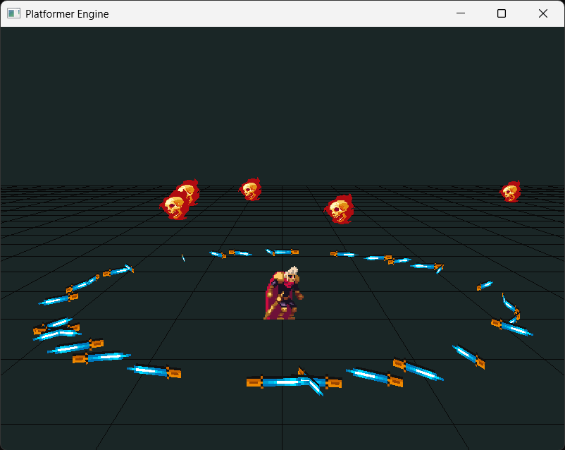

# Platformer Engine

A 2D/3D platformer game engine built with C and OpenGL.



## Overview

This project is a custom 2D/3D platformer game engine that provides:

- OpenGL-based rendering
- GLFW window and input handling
- Controller/gamepad support
- Camera management
- PNG image loading via stb_image
- Basic physics and collision detection
- 3D model loading and rendering using cgltf and cglm

## Controls

The engine supports only gamepad (PS5 controller)

## Assets

Game assets are from the [Gothicvania Patreon Collection](https://ansimuz.itch.io/gothicvania-patreon-collection) by Ansimuz. (feel free to support the creator)

just copy Terrible Knight and Fire-Skull-Files folder to the assets folder 

```
assets/
├── Terrible Knight/
├── Fire-Skull-Files/
└── ...
``` 

## Building (Windows) TODO: complete setup

### Clone with Submodules

This project uses Git submodules for dependencies. When cloning the repository, use:

```bash
# Clone the repository with submodules
git clone --recursive https://github.com/yourusername/platformer-engine.git

# Or if you've already cloned the repository without --recursive:
git submodule update --init --recursive
```

### Build with CMake

The project uses CMake for building:

```bash
mkdir build
cd build
cmake ..
make
```

## Dependencies

- GLFW
- GLAD
- cglm
- stb_image
- cgltf

All dependencies are included as Git submodules and will be automatically set up when following the instructions above.


